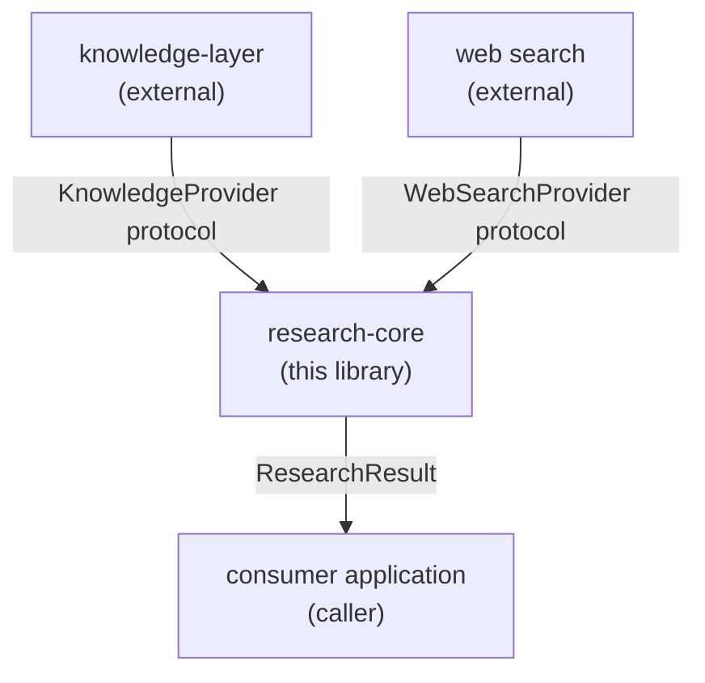

# Architecture — research-core

**Version:** RC2
**Status:** RC2 complete — KnowledgeAdapter implemented; engine not yet implemented

---

## System Context

`research-core` is a Python library that sits between an external knowledge source and a consumer application.



`research-core` does not depend on any consumer application, strategy layer, editorial layer, or decision layer. The dependency arrow always points upward in the stack.

---

## Architectural Goals

1. **Domain neutrality.** The core package contains no domain-specific schemas, taxonomies, or report sections. Domain configuration is always caller-supplied.

2. **Structured canonical output.** `ResearchResult` is the single authoritative output. Every renderer, formatter, and downstream consumer derives from it.

3. **Full provenance.** Every evidence item preserves its source identity, type, retrieval context, and transformation lineage from acquisition through synthesis.

4. **Explicit failure semantics.** Every error condition — missing profile, unavailable provider, empty retrieval, low-quality evidence — has a defined, diagnosable outcome. No silent fallback.

5. **Testable by design.** Core domain contracts depend only on the Python standard library. Provider adapters and analysis services can be replaced with deterministic stubs for testing.

6. **Clean dependency direction.** `research-core` depends on the knowledge layer (through a provider boundary) and on narrow external packages (in adapters only). It is never a dependency of the layers it must remain independent from.

7. **Separation of analysis and rendering.** Claim extraction, contradiction detection, and gap analysis are analysis responsibilities. Formatting their output for human consumption is a renderer responsibility. These two concerns must not be mixed.

---

## Architectural Principles

- **Fail loudly over silent fallback.** A missing or unknown profile is an error, not a substitution opportunity.
- **Evidence before prose.** Claims are derived from evidence. Prose is derived from claims. Prose is never injected without traceable backing.
- **Contradictions are visible.** Conflicting evidence is represented explicitly in the output, not absorbed into narrative.
- **Gaps are honest.** The system must not report "no gaps" when evidence coverage is incomplete.
- **Provider isolation.** The core domain contracts have no awareness of specific knowledge-layer implementations, LLM providers, or web search providers.
- **No environment reads in domain models.** Domain model objects do not read environment variables, access the filesystem, or perform network calls.
- **Provenance is immutable.** Once recorded, source identity and retrieval lineage are never altered by downstream processing.

---

## Python Version Floor

The minimum supported Python version is 3.11.

Rationale: the `match` statement (3.10), `tomllib` (3.11), `Self` type (3.11), and `TypeVarTuple` (3.11) are all available without backport packages. 3.11 performance improvements also benefit evidence-processing workloads. The version floor is documented here and in `pyproject.toml`.

---

## Conceptual Pipeline


Each stage has a defined input contract, an observable output, and a failure mode. No stage silently swallows errors.

---

## High-Level Component Model

```
research-core/
├── core domain contracts        (ResearchRequest, ResearchResult, Claim, EvidenceItem, ...)
├── provider protocols           (KnowledgeProvider, WebSearchProvider, ProfileProvider, Synthesizer)
├── provider adapters            (KnowledgeAdapter, DuckDuckGoAdapter, ...)
├── analysis services            (EvidenceRanker, ClaimExtractor, ContradictionDetector, GapAnalyzer)
├── orchestration                (ResearchEngine, pipeline coordination)
├── renderers                    (MarkdownRenderer, ...)
└── CLI                          (entry point; introduced in RC8)
```

### Component responsibilities

| Component | Responsibility | May import |
|---|---|---|
| Core domain contracts | Define typed data structures only | Python stdlib only |
| Provider protocols | Define abstract interfaces for external integrations (`KnowledgeProvider`, `WebSearchProvider`, `ProfileProvider`, `Synthesizer`) | Core contracts |
| Provider adapters | Implement provider protocols against real external systems | Provider protocols, core contracts, narrow external packages |
| Analysis services | Execute analysis against the normalized evidence model | Core contracts, own protocols |
| Orchestration | Coordinate the pipeline stages | Contracts, provider protocols, analysis services |
| Renderers | Transform `ResearchResult` into human-readable formats | Core contracts (result structures only) |
| CLI | Parse arguments and invoke the public API | Public application API only |
| Consumer applications | Use `research-core` as a library | `research-core` public API; never the reverse |

---

## Core Domain Model Direction

The following concepts define the intended domain model. Detailed Python class definitions are deferred to RC1.

### ResearchRequest

Caller-supplied input. Contains the question, optional profiles, optional web flag, and provider configuration.

`profiles` is a list of profile identifier strings. Profile resolution occurs through a caller-supplied `ProfileProvider` or registry interface. `research-core` does not contain a built-in domain-profile registry. An unknown profile identifier raises a typed error at validation time. There is no silent fallback to any default profile.

### ResearchResult

The canonical output. All renderer output is derived from this structure. Contains: `summary`, `claims`, `evidence`, `contradictions`, `research_gaps`, `open_questions`, `sources`, `quality_diagnostics`, `trace`.

A `ResearchResult` carries a `status` field. A complete result has `status="complete"`. A result where useful evidence was produced but some later stage failed has `status="partial"`. A partial result preserves all structured artifacts that were successfully produced and must never be treated as equivalent to a complete result.

Conditions that prevent any meaningful result (e.g., invalid request, total provider failure before evidence is produced) raise typed exceptions rather than returning a result object.

A future strict-execution option on the engine may instruct it to raise a typed exception instead of returning a partial result.

### Claim

A discrete factual or analytical assertion extracted from evidence. A claim has an identifier, a statement, a confidence level, a list of supporting evidence item IDs, a list of contradicting evidence item IDs, and a flag indicating whether it is corroborated.

A claim is never the same as the evidence that supports it.

### EvidenceItem

A discrete piece of evidence retrieved from a source. Contains: a unique identifier, the source reference, the raw content excerpt, the relevance score, the quality score, the extraction confidence, and provenance metadata.

Evidence items are never collapsed into prose without traceability.

### Source

A source registry entry. Contains: source type (`knowledge` | `web`), source identifier, document identifier (for knowledge sources), URL (for web sources), publication date, authority score, and retrieval timestamp.

### Provenance

Transformation lineage for an evidence item or claim. Records: what was retrieved, from where, when, with what parameters, and what transformations were applied before the item reached its current form.

### Contradiction

A detected conflict between two or more claims or evidence items. Contains: the conflicting items, the conflict type (see below), the severity, and the resolution status.

**Contradiction types the architecture must support:**

| Type | Example |
|---|---|
| Numeric estimate | Market size reported as $5B vs $12B by two sources |
| Date / temporal | Product launch reported as Q1 2024 vs Q3 2024 |
| Growth rate | CAGR reported as 8% vs 15% |
| Definition | "sports consulting" defined as performance-only by one source, broadly as business services by another |
| Scope | One source reports global figures; another reports North America only |
| Methodology | One study uses survey data; another uses transaction data |
| Entity identity | Two sources disagree on whether two named entities are the same organization |
| Categorical assertion | One source asserts X is a growth market; another asserts X is declining |

### ResearchGap

An identified gap in evidence coverage. Contains: the gap type, the dimension not covered, severity, and recommended resolution.

**Conditions that must produce at least one gap:**

- No source documents were loaded
- No useful evidence was retrieved
- Important dimensions were not searched
- Evidence coverage is incomplete
- Source quality is below the configured threshold
- Important claims are uncorroborated
- Conflicting evidence remains unresolved
- Evidence is stale relative to the configured recency threshold
- Claim extraction confidence is below threshold

### QualityDiagnostics

A structured multidimensional quality assessment. Component scores must be individually accessible. A composite score is optional and additive. See `docs/product/PRODUCT_BRIEF.md` for the full dimension list.

### ResearchTrace

A structured execution log. Records what was retrieved at each stage, what decisions were made, what was filtered or ranked out, and why. The trace enables post-hoc inspection and debugging without re-running the pipeline.

---

## Provider Boundaries

### ProfileProvider

Abstracts profile resolution. The caller supplies a `ProfileProvider` instance (or a compatible registry) that resolves string profile identifiers to profile configuration objects. The core does not contain any built-in domain profiles. If the caller does not supply a `ProfileProvider`, `profiles` must be absent from the `ResearchRequest`. If profiles are requested and the `ProfileProvider` returns no match for a given identifier, the engine raises `UnknownProfileError` — no fallback, no substitution.

### KnowledgeProvider

Abstracts the knowledge layer. `research-core` calls the provider through a defined protocol; it does not import `knowledge.store` or `knowledge.retriever` directly from core domain logic.

The provider protocol is defined in `research_core` (in RC1). The adapter implementation depends on the external `knowledge` package (introduced in RC2).

### WebSearchProvider

Abstracts web search and web page acquisition. The protocol is defined in `research_core`. The DuckDuckGo adapter is implemented in RC3. The adapter depends on `ddgs`, `requests`, `trafilatura`, and related packages — none of these appear in the core contracts.

---

## Boundary Definitions

### Orchestration boundary

The `ResearchEngine` orchestrates the pipeline. It:
- Validates the `ResearchRequest`
- Dispatches to the knowledge provider
- Optionally dispatches to the web provider
- Passes retrieved content to normalization and ranking
- Coordinates analysis services
- Collects the structured result

The orchestrator does not implement analysis logic. It delegates.

### Source normalization boundary

Normalizes documents from all sources into a unified `EvidenceItem` model. This stage is responsible for converting raw retrieval results — which differ in schema between knowledge and web sources — into the canonical evidence representation while preserving provenance.

### Evidence ranking boundary

Ranks evidence items by relevance, quality, and recency. Produces an ordered, scored evidence pool for downstream analysis. Does not modify evidence content.

### Claim analysis boundary

Extracts discrete claims from the ranked evidence pool. Each claim references the evidence items it was derived from. This stage may be deterministic (rule-based) or LLM-assisted; the protocol must support both.

### Contradiction detection boundary

Compares claims and evidence items to identify conflicts. Produces a list of `Contradiction` objects. Does not modify the claims or evidence it analyses. Does not suppress contradictions based on severity.

### Research gap analysis boundary

Evaluates the evidence pool against a set of gap conditions (see ResearchGap above). Produces a list of `ResearchGap` objects. This stage must run even when synthesis succeeds — gaps are not a failure state, they are a quality diagnostic.

### Synthesis boundary

Synthesis is provider-based. The `Synthesizer` is a protocol, not a concrete class. The core is not coupled to any LLM SDK. An LLM-assisted synthesis provider may be the primary production path, but a deterministic synthesis provider must remain supported for tests, constrained workflows, reproducibility, and fallback.

The synthesizer produces the `summary` and assembles the final `ResearchResult` from the analysed evidence pool. It does not perform retrieval. It does not modify evidence provenance.

A synthesis failure produces `ResearchResult(status="partial")` with all pre-synthesis artifacts (evidence, claims, contradictions, gaps, quality diagnostics, trace) preserved. The partial result must not be treated as equivalent to a complete result.

### Renderer boundary

Transforms a `ResearchResult` into a human-readable or machine-readable format. Renderers are consumers of the structured result; they do not produce it. A failing renderer does not invalidate the `ResearchResult`.

**Markdown is one renderer.** It is not the canonical output. Its output is not stored as the result; the `ResearchResult` structure is.

### Configuration boundary

Provider selection, profile loading, threshold values, and feature flags are resolved before the pipeline runs. Domain entities do not read environment variables or configuration files. Configuration is injected.

---

## Error Handling Philosophy

The following conditions are distinct and must be handled distinctly:

| Condition | Expected Handling |
|---|---|
| Invalid request | Raise before the pipeline starts; no partial result |
| Unsupported configuration | Raise at engine initialization; caller can catch and reconfigure |
| Unknown profile | Raise at request validation; never silently fall back to another profile |
| Unavailable provider | Raise at provider dispatch; optionally degrade to partial result if another provider is available |
| Provider failure | Raise or return a partial result with an explicit `provider_error` diagnostic |
| Empty retrieval result | Return a partial result with explicit gap diagnostics; do not synthesize from nothing |
| Incomplete evidence coverage | Return a result with explicit gap annotations; do not suppress gaps |
| Low-quality evidence | Include in `quality_diagnostics`; do not treat as equivalent to high-quality evidence |
| Unresolved contradiction | Represent explicitly in `contradictions`; do not absorb into prose |
| Synthesis failure | Return a partial result with synthesis_error status; preserve retrieved evidence |
| Renderer failure | Log and surface; the `ResearchResult` remains valid regardless |

An empty evidence set must never be presented as a successful and complete research result.

---

## Deterministic versus Model-Assisted Responsibilities

| Stage | Deterministic baseline | Model-assisted path (future) |
|---|---|---|
| Request validation | Always deterministic | — |
| Knowledge retrieval | Always deterministic | Reranking may use an embedding model |
| Web acquisition | Always deterministic | — |
| Source normalization | Always deterministic | — |
| Evidence ranking | Deterministic scoring formulas | Embedding similarity may augment |
| Claim extraction | Pattern-based baseline | LLM-assisted extraction in RC5 |
| Contradiction detection | Rule-based baseline for numeric/date | LLM-assisted for definitional/scope |
| Gap analysis | Always deterministic (coverage thresholds) | — |
| Synthesis | Template-based baseline | LLM-assisted in RC7 |
| Rendering | Always deterministic | — |

Deterministic baselines exist for every stage so that the system can be tested without LLM calls. LLM-assisted paths are introduced as optional enhancements after the deterministic contract is defined and tested.

---

## Traceability Expectations

1. Every `EvidenceItem` can be traced to its source document or URL.
2. Every `Claim` can be traced to the evidence items it was derived from.
3. Every `Contradiction` references the specific claims or evidence items in conflict.
4. Every `ResearchGap` names the dimension that is missing and why it was flagged.
5. The `ResearchTrace` records: retrieval parameters, evidence counts at each filtering stage, ranking decisions, extraction events, and synthesis inputs.
6. A caller must be able to reproduce the reasoning from the trace without re-running the pipeline.

---

## Extensibility Model

- **New knowledge providers:** Implement `KnowledgeProvider` protocol. No changes to core.
- **New web providers:** Implement `WebSearchProvider` protocol. No changes to core.
- **New analysis services:** Implement the relevant analysis protocol. Register with the orchestrator.
- **New renderers:** Accept `ResearchResult` and produce output. No changes to core.
- **New profiles:** Caller-constructed objects; no changes to core.
- **New quality dimensions:** Add to `QualityDiagnostics` without removing existing fields.

The core contracts are stable across adapters. Adding a new adapter never requires changing a core contract.

---

## Testing Strategy

| Test type | Purpose | Introduced |
|---|---|---|
| Package import test | Confirm clean import with no side effects | RC0 |
| Documentation existence test | Confirm required docs are present | RC0 |
| Import boundary test | Confirm prohibited packages are not imported | RC0 |
| Contract test | Confirm each domain type satisfies its invariants | RC1 |
| Protocol conformance test | Confirm adapters implement the protocol correctly | RC2, RC3 |
| Provider adapter test | Test adapter against a stub or real provider | RC2, RC3 |
| Deterministic fixture test | Test analysis services with fixed inputs | RC4–RC6 |
| Integration test | Test the full pipeline with a known evidence set | RC7 |
| Renderer snapshot test | Confirm renderer output is stable | RC7 |
| CLI test | Confirm CLI entry point works end-to-end | RC8 |

Architecture enforcement via import boundary tests is preferred over heavy static analysis tooling. Optional static dependency checks (e.g. `import-linter`) may be introduced later.

---

## Observability and Trace Direction

The `ResearchTrace` structure (defined in RC1) will record:

- `request_id` — unique identifier for the research run
- `stages` — list of stage entries with timing, input summary, and output summary
- `evidence_counts` — counts at each filtering/ranking stage
- `provider_calls` — which providers were called, with what parameters
- `extraction_events` — claims extracted, confidence levels
- `contradiction_events` — contradictions detected
- `gap_events` — gaps flagged and reasons
- `synthesis_inputs` — what was passed to synthesis

The trace is included in `ResearchResult` and is accessible to callers. It is not produced by a separate logging system; it is a first-class output.

---

## Security and Privacy Considerations

1. **No credentials in domain models.** API keys, tokens, and credentials are injected into provider adapters, not stored in domain objects or environment-variable reads inside domain code.

2. **No PII in core schema.** The core domain model does not define fields for personally identifiable information. If a consumer needs PII handling, they supply it through a custom profile or post-processing layer.

3. **Web content.** Acquired web pages may contain arbitrary content. The normalization stage is responsible for extracting only the relevant text excerpt and discarding the raw page. Raw page content must not be stored in `EvidenceItem`.

4. **Trace sensitivity.** The `ResearchTrace` may contain retrieved document excerpts. Callers are responsible for determining whether the trace is safe to log or persist.

5. **Provider credentials.** Provider adapters that require API credentials must accept them as constructor parameters, not from global state.

---

## Future Packaging Direction

- `research-core` is distributed as a standalone Python package (`research-core` on PyPI, or as a private package).
- The `knowledge` package is an optional dependency that is not required for a functional installation; it is needed only when using the `KnowledgeAdapter`.
- Web provider dependencies (`ddgs`, `requests`, `trafilatura`, etc.) are optional extras, not default runtime dependencies.
- LLM SDK dependencies are optional extras introduced in RC7.

Packaging extras for RC8+:

```toml
[project.optional-dependencies]
knowledge = ["knowledge-layer>=..."]
web = ["ddgs>=...", "requests>=...", "trafilatura>=..."]
llm = ["anthropic>=..."]
all = ["research-core[knowledge,web,llm]"]
```

Exact version constraints are defined when the adapters are implemented.
